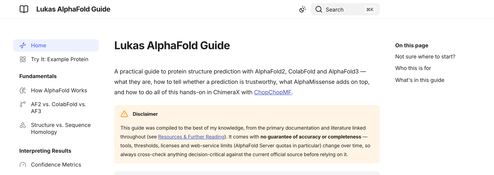

# Lukas AlphaFold Guide

[](https://lukasinscience.github.io/AlphaFold-Guide/)

### → [**Read the live guide**](https://lukasinscience.github.io/AlphaFold-Guide/)

A practical, beginner-to-expert guide to AlphaFold2, ColabFold, AlphaFold3, AlphaMissense, and hands-on structure analysis in ChimeraX.


## Run it locally

Prefer your own copy over the live site? You need Python 3.9+.

**1. Get the files** — either:

```bash
git clone https://github.com/LUKASinScience/AlphaFold-Guide.git
```

or on this page: **Code → Download ZIP**, then unzip it. No git required either way.

**2. Install Zensical** (the static site generator this guide is built with):

```bash
cd AlphaFold-Guide
python -m venv .venv && source .venv/bin/activate
pip install zensical
```

**3. Run it:**

```bash
zensical serve
```

Open the printed `http://localhost:8000` address — live-reloading, full search, identical to the hosted site.

> [!WARNING]
> If you use `zensical build` instead (produces a static `site/` folder), don't just double-click the resulting `index.html` — opening it directly (`file://`) silently breaks the search box. Serve that folder too, e.g. `python -m http.server` from inside `site/` (no extra install needed), then open `http://localhost:8000`.

`docs/` holds all content; `zensical.toml` holds config and nav.

## License

CC BY 4.0 — see [LICENSE](LICENSE) and [THIRD_PARTY_NOTICES.md](THIRD_PARTY_NOTICES.md)
(vendored Mol* viewer is MIT).

## Author

Lukas W. Bauer — [github.com/LUKASinScience](https://github.com/LUKASinScience)
· plugins used by this guide: [ChopChopMF](https://github.com/LUKASinScience/ChopChopMF), [ChimeraX-FigureStyle](https://github.com/LUKASinScience/ChimeraX-FigureStyle)
