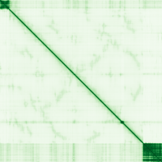

# Try It: A Real Example Protein

Every confidence-metric explanation in this guide is easier to trust once you've actually seen it on a real structure. Below is a live, interactive [Mol\*](https://molstar.org) viewer loading a real entry straight from the [AlphaFold Protein Structure Database](https://alphafold.ebi.ac.uk) — not a screenshot.

!!! info "Beginner"
    This is **BRCA1** (UniProt [P38398](https://www.uniprot.org/uniprotkb/P38398)) — the same protein already used as the AlphaMissense-mapping fetch example in [ChopChopMF Workflows](chopchopmf/workflows.md#2-is-this-variant-likely-pathogenic-alphamissense-mapping). It's a genuinely good teaching example, not a cherry-picked pretty one: BRCA1 is a large, famously mostly-**disordered** protein with only a couple of small, well-folded domains (a RING domain near the N-terminus, a tandem BRCT domain at the C-terminus). Drag to rotate, scroll to zoom, and watch how the color maps directly onto what's structured vs. disordered.

<div class="af-viewer-wrap" markdown="0">
  <div id="af-molstar-app" class="af-viewer"></div>
</div>

!!! tip "Advanced: what you're actually looking at"
    The structure is colored by **pLDDT** using Mol*'s built-in AlphaFold confidence theme — the same orange → blue scale from the [Confidence Metrics](interpreting-results/confidence-metrics.md#plddt-per-residue-local-confidence) page, fetched live from AlphaFold DB. The real numbers for this exact entry, pulled from the same API the viewer uses:

    | pLDDT band | Fraction of BRCA1 |
    |---|---|
    | Very high (>90) | 11.1% |
    | Confident (70–90) | 6.3% |
    | Low (50–70) | 2.2% |
    | Very low (<50) | **80.4%** |

    Eighty percent of this protein is "very low" pLDDT — and that's not a failed prediction. It matches what's independently known about BRCA1: large intrinsically disordered regions connecting a handful of small, real, well-characterized folded domains. This is exactly the pattern discussed in [pLDDT is not a clean disorder detector](interpreting-results/confidence-metrics.md#plddt-per-residue-local-confidence) — color, don't just read the number.

    Here's the real PAE plot for the same entry:

    { .af-pae-img }

    Notice the single small dark block near the bottom-right corner — that's the folded BRCT domain. Everywhere else is light: no confident *relative* positioning, consistent with a long, floppy disordered chain. Exactly the [PAE](interpreting-results/confidence-metrics.md#pae-predicted-aligned-error) lesson: pLDDT and PAE are telling the same story here from two different angles.

    That same BRCT domain is also the worked example for cropping a real rigid domain before a Foldseek search — see [Structure vs. Sequence Homology](fundamentals/structure-vs-sequence-homology.md#the-practical-workflow).

!!! note "Data source & license"
    Structure and confidence data fetched live from the [AlphaFold Protein Structure Database](https://alphafold.ebi.ac.uk) (EMBL-EBI / DeepMind), available under [CC-BY 4.0](https://creativecommons.org/licenses/by/4.0/). Viewer: [Mol\*](https://molstar.org) (MIT license), self-hosted with this guide — no external viewer service or account needed, though the structure data itself is fetched from AlphaFold DB when this page loads.

## Reproduce this yourself, locally

!!! tip "Advanced: raw ChimeraX commands"
    No plugin needed for the basics — three commands in the ChimeraX command line reproduce everything on this page:

    ```text
    open P38398 from alphafold
    color bfactor palette alphafold
    alphafold pae uniprotId P38398
    ```

    The first fetches the structure directly from AlphaFold DB by UniProt ID (equivalent: `alphafold fetch P38398`). The second applies the same blue/orange pLDDT palette shown above — AlphaFold-fetched structures store pLDDT in the B-factor column, so this is really just "color by B-factor with AlphaFold's palette." The third fetches and opens the interactive PAE plot for the same entry.

??? example "Expert: the same thing via ChopChopMF (no commands typed)"
    If you'd rather point-and-click, this is exactly [ChopChopMF workflow 1](chopchopmf/workflows.md#1-first-look-at-a-fresh-alphafold-model-plddt-coloring):

    1. **Fetch PDB → AlphaFold2**, enter `P38398`, fetch.
    2. Select the model, click **pLDDT Coloring**.
    3. Optionally run **AlphaSync Residue Analysis** on the same model for the full per-residue table (pLDDT, SASA, RSA, disorder, secondary structure) instead of reading colors by eye.

    ChopChopMF's PAE tools ([workflow 5](chopchopmf/workflows.md#5-reading-confidence-in-a-multimercomplex-pae-contacts)) are built for *multi-chain* complexes specifically — for a monomer like this one, the raw `alphafold pae` command above (or the [PAE Viewer](https://pae-viewer.uni-goettingen.de/)) is the more direct route to the same plot shown here.

<script>
(function () {
  function loadScript(src) {
    return new Promise(function (resolve, reject) {
      if (document.querySelector('script[data-af-molstar]')) { resolve(); return; }
      var s = document.createElement('script');
      s.src = src;
      s.dataset.afMolstar = "1";
      s.onload = resolve;
      s.onerror = reject;
      document.body.appendChild(s);
    });
  }

  function loadCss(href) {
    if (document.querySelector('link[data-af-molstar-css]')) return;
    var l = document.createElement('link');
    l.rel = 'stylesheet';
    l.href = href;
    l.dataset.afMolstarCss = "1";
    document.head.appendChild(l);
  }

  function initViewer() {
    var el = document.getElementById('af-molstar-app');
    if (!el || el.dataset.afInit === "1") return;
    el.dataset.afInit = "1";

    loadCss("/assets/molstar/molstar.css");
    loadScript("/assets/molstar/molstar.js").then(function () {
      if (!window.molstar) return;
      window.molstar.Viewer.create(el, {
        layoutIsExpanded: false,
        layoutShowControls: false,
        layoutShowRemoteState: false,
        layoutShowSequence: true,
        layoutShowLog: false,
        layoutShowLeftPanel: false,
        viewportShowExpand: true,
        viewportShowSelectionMode: false,
        viewportShowAnimation: false,
        pdbProvider: 'rcsb',
        emdbProvider: 'rcsb',
      }).then(function (viewer) {
        if (viewer.plugin && viewer.plugin.canvas3d) {
          viewer.plugin.canvas3d.setProps({ renderer: { backgroundColor: 0x0d1117 } });
        }
        viewer.loadAlphaFoldDb('P38398');
      });
    });
  }

  if (window.document$ && typeof window.document$.subscribe === "function") {
    window.document$.subscribe(initViewer);
  } else {
    initViewer();
    document.addEventListener("DOMContentLoaded", initViewer);
  }
})();
</script>

Continue to [Reading Confidence Metrics →](interpreting-results/confidence-metrics.md)
