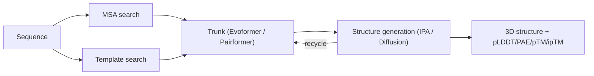

# How AlphaFold Actually Works

You don't need to understand the Evoformer to use AlphaFold responsibly — but understanding roughly *why* it makes the predictions it does will make the confidence metrics on the [next page](../interpreting-results/confidence-metrics.md) click into place instead of feeling arbitrary.

## The core idea

!!! info "Beginner"
    The "protein folding problem" asks: given a linear chain of amino acids, what 3D shape does it fold into? AlphaFold answers this by learning from **evolution**, using two main sources of information:

    1. **Coevolution across related sequences.** Proteins related by descent tend to keep the same overall fold even as their exact sequence drifts (two myoglobin variants can share as little as ~25% sequence identity and still fold the same way). If two positions in a protein are close together in 3D space, mutations at one position are often "compensated" by correlated mutations at the other — e.g. if a buried, spatially-adjacent partner flips from negative to positive charge, its neighbor across the contact often flips too, to preserve the physical interaction. AlphaFold finds these correlated-mutation patterns across a **multiple sequence alignment (MSA)** of homologous sequences and uses them as a proxy for "these two residues are probably in contact."
    2. **Structural templates**, when available — existing solved structures of homologous proteins, fed in as prior hints.

    The output isn't just a shape — it comes with **per-residue and pairwise confidence scores** (pLDDT, PAE) telling you how much to trust each part. That's covered in depth on the [Confidence Metrics](../interpreting-results/confidence-metrics.md) page.

!!! tip "Advanced: the three-stage pipeline"
    AlphaFold2 runs three stages, iteratively: **(1) preprocessing** (MSA + template search), **(2) a trunk network** that refines abstract representations of the sequence and residue-residue relationships, and **(3) a structure-generation module** that turns those representations into actual 3D coordinates. The trunk's output is fed back into itself for multiple **recycling** iterations, progressively refining the prediction using the same network weights each pass.

    MSA depth matters directly: AlphaFold2's own paper notes accuracy "drops substantially when the mean alignment depth is less than ~30 sequences" — proteins with few known relatives are simply harder to predict, independent of how hard their fold intrinsically is.

!!! note "What the official 'folding in progress' animation shows"
    DeepMind's own supplementary materials include a video of the structure visibly settling into shape across recycling iterations — the same loop shown schematically above (Structure module → back into the trunk → refine → repeat). If you want to see what that looks like in motion rather than as a diagram, [this GitHub issue](https://github.com/google-deepmind/alphafold/issues/92) links the animated version from the original AlphaFold Colab notebook.

## The trunk: Evoformer (AF2) → Pairformer (AF3)

!!! question "Does AlphaFold2 explicitly model coevolution?"
    This comes up often enough to be worth addressing directly ([recent example](https://github.com/google-deepmind/alphafold/issues/1036)): **not in the classical sense, no.** Pre-deep-learning methods (direct coupling analysis / DCA, GREMLIN, and similar) explicitly *compute* a coevolution statistic — a mutual-information or Potts-model coupling score between column pairs of the MSA — and feed that number in as an engineered feature. AlphaFold2 does no such thing. It feeds the **raw MSA** into the Evoformer's row/column attention and outer-product-mean operations and lets the network learn, end-to-end, whatever combination of sequence patterns is useful for predicting contacts — which may overlap heavily with what classical coevolution statistics capture, but is never explicitly computed as a standalone quantity anywhere in the pipeline. So "AlphaFold uses coevolution" is a reasonable informal shorthand for *why* the MSA is informative, but "AlphaFold explicitly models coevolution" overstates what's actually implemented — it's learned and implicit, not an engineered preprocessing step.

??? example "Expert: AlphaFold2's Evoformer"
    The Evoformer is a stack of **48 blocks** that jointly refines two representations: the **MSA representation** (information from all the homologous sequences) and the **pair representation** (a hypothesis about which residue pairs are in contact). The pair representation is treated as both output and intermediate layer, so the two representations continuously update each other.

    - **MSA processing** uses **axial attention** — row-wise attention (across residues within one sequence, finding correlated pairs) and column-wise attention (across sequences at one position, weighing which homologs are informative) — instead of full quadratic self-attention over the whole MSA. Row-wise attention is biased by the current pair representation, letting the model's best current guess about contacts sharpen the MSA analysis.
    - **Pair representation processing** arranges attention in "triangles of residues" to explicitly enforce the **triangle inequality**: for any three residues i, j, k, the pairwise distances must satisfy dist(i,j) ≤ dist(i,k) + dist(k,j). Earlier deep-learning contact-prediction methods that predicted pairwise distances independently often produced sets of distances that couldn't be geometrically embedded into any consistent 3D structure at all — triangle updates fix this at the representation level, before 3D coordinates even exist.

??? example "Expert: AlphaFold3's Pairformer"
    AF3 replaces the Evoformer with the **Pairformer**, which keeps the single-sequence and pair representations but **removes the full MSA representation from the main trunk**. Evolutionary information is instead folded in earlier via a much lighter **MSA module** (~4 blocks vs. AF2's 48 Evoformer blocks):

    - The *only* point where information is shared across evolutionary sequences is an **Outer Product Mean** operation: for each token pair (i,j), outer products of MSA columns are computed across all sequences, averaged, and projected into the pair representation — a dramatic simplification of AF2's full row+column MSA attention.
    - Triangle multiplicative updates and triangle attention carry over essentially unchanged from the Evoformer, still enforcing triangle-inequality consistency.
    - For protein complexes specifically, AF3 uses a **UniProt-derived MSA** (one canonical sequence per species per chain), so cross-species co-mutation patterns can inform predicted inter-chain binding sites — something per-chain-only MSAs can't provide.
    - **Tokenization is generalized** so the same architecture handles arbitrary molecule types: standard amino acids/nucleotides get one token per residue, while non-standard residues and ligands get one token per *atom*.

## From representations to 3D coordinates

??? example "Expert: AF2's Structure Module (Invariant Point Attention)"
    Each residue starts as an independent rigid body ("residue gas") placed at the coordinate origin, then iteratively displaced/rotated into its final position via a 4×4 affine transformation predicted and refined at each step. The key mechanism is **Invariant Point Attention (IPA)**:

    - It is **invariant to global rotation/translation** of the whole structure — rotating the entire protein doesn't change the prediction, acting as free data augmentation and reducing the training data needed.
    - It incorporates the pair representation as a bias on the attention computation before softmax.
    - Side chains are predicted via torsion (dihedral) angles, then converted to atom positions by a fixed geometric routine.
    - Training uses **FAPE (Frame Aligned Point Error)**, an RMSD-like loss computed in local reference frames that is deliberately *not* invariant to reflections — this prevents the network from ever producing a mirror-image (wrong-chirality, physically impossible) structure.

??? example "Expert: AF3's Diffusion Module"
    AF2's deterministic IPA-based Structure Module is entirely replaced by a **generative diffusion model**. At inference, the model starts from *random* 3D coordinates and iteratively denoises them into a final structure, conditioned on the trunk's representations — roughly 30 sequential attention blocks (3 local atom-level → 24 global token-level → 3 local atom-level again) per denoising pass.

    Instead of architecturally guaranteeing rotation/translation invariance the way IPA did, AF3 achieves it by **training-time augmentation**: randomly rotating/translating the structure at every diffusion step (recentering on center of mass, random translation). ReLU activations are replaced by **SwiGLU**, and standard LayerNorm by **Adaptive LayerNorm**, whose scale/bias are themselves predicted from a conditioning signal rather than fixed.

    A practical consequence worth knowing: AF3's confidence heads produce **per-atom** pLDDT (50 bins) and PAE (64 bins) instead of AF2's per-residue pLDDT, plus a new **PDE (Predicted Distance Error)** head (64 bins) — see [Confidence Metrics](../interpreting-results/confidence-metrics.md) for how to read these.

## Compute footprint

!!! tip "Advanced"
    Original AF2 training used roughly 128 TPUv3 cores (~100–200 GPU-equivalent). Inference is far cheaper — AF2 has run on a single ~20GB GPU or even CPU-only with ~300GB RAM, though it strains a typical laptop. The full AF2 database bundle for MSA/template search is roughly **2.5 TB**, dominated by the ~2TB **BFD** ("Big Fantastic Database"). See [Running ColabFold (local/HPC)](../running-colabfold/hpc-and-local.md) for what this means in practice on a shared cluster.

Continue to [AF2 vs. ColabFold vs. AF3 →](af2-vs-colabfold-vs-af3.md)
