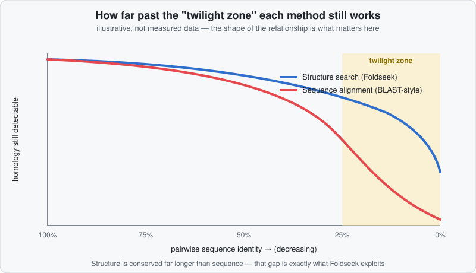

# Structure vs. Sequence Homology: Inferring Function When BLAST Comes Up Empty

For decades, the standard way to guess what an unknown protein does was: align its sequence against everything with a known function, find the closest match, and borrow its annotation. That approach has a hard limit — and AlphaFold plus [Foldseek](https://github.com/steineggerlab/foldseek) is exactly what lets you push past it.

## The classical approach — and where it breaks

!!! info "Beginner"
    Historically, protein evolution has mostly been studied through this lens: a gene existed in some ancestral organism, got duplicated and inherited across descendant species/lineages, and *drifted* — accumulating mutations — while (usually) keeping a similar overall shape and function. **Sequence alignment** exploits this directly: find a sequence similar enough to a query, and you've very likely found a protein with a similar function, because shared sequence is strong evidence of shared ancestry (**homology**).

    This works beautifully for close relatives. It breaks down once sequences have diverged far enough — below roughly 20–25% pairwise identity, often called the **"twilight zone,"** alignment scores become statistically indistinguishable from chance. A huge fraction of "hypothetical protein, function unknown" entries in sequence databases sit exactly in or below this zone: real, functional proteins with no sequence-detectable relatives.

    { .af-diagram-svg }

## Structure is conserved long after sequence isn't

!!! tip "Advanced: the structure-function principle"
    Three-dimensional structure evolves far more slowly than sequence. A protein's fold is shaped by physical constraints (what actually stays stable, foldable, and functional) that outlast which specific amino acids happen to occupy which positions — so two sequences can drift into the twilight zone and beyond while the **fold itself stays essentially unchanged**, because function depends on structure, and structure is what's actually under selection. This is sometimes summarized as the **structure-function principle**: shape, not sequence identity, is the more direct carrier of biological function.

    This is precisely why **AlphaFold + Foldseek** is such a powerful combination for an unknown protein:

    1. AlphaFold predicts a 3D structure for essentially any sequence — including ones with zero detectable homologs, where sequence-based tools have nothing to work with.
    2. [Foldseek](https://github.com/steineggerlab/foldseek) then searches by **structure**, not sequence — converting structures into a compact structural alphabet ("3Di") and searching that the way MMseqs2 searches sequences. Published benchmarks show it running **four to five orders of magnitude faster** than classical structure aligners (Dali, TM-align, CE) while matching or exceeding their sensitivity on standard benchmarks (86–133% relative sensitivity depending on the comparison method) — fast enough to search hundreds of millions of structures, including the entire AlphaFold DB.

    Practically: you predict the structure of your mystery protein, search it against structures of proteins with *known* function, and a confident hit gives you a function hypothesis that sequence search alone would never have surfaced.

## Two different reasons two proteins can share a fold

!!! tip "Advanced: don't conflate these"
    When Foldseek finds a strong structural match with no detectable sequence similarity, there are two distinct evolutionary explanations — worth keeping separate, because they support different conclusions:

    - **Remote (deep) homology — by far the more common case.** The two proteins really do share a common ancestor; the sequence has simply diverged past the point where alignment can detect it, while the fold — under stronger functional/physical constraint — has not. This is the primary phenomenon Foldseek is built to recover: homology relationships real but invisible to sequence-based search.
    - **True convergent evolution — genuinely independent origins.** Two proteins with *no* shared ancestry independently arrive at a similar structural solution because it's a good (sometimes the only good) way to solve a given physical/chemical problem. This is real, but it's most robustly documented at the level of a local active site or motif rather than an entire global fold. The textbook example: **chymotrypsin and subtilisin** — completely different overall folds, no detectable sequence homology, yet both independently evolved a near-identical **Ser–His–Asp catalytic triad** with the same geometric arrangement, because that arrangement is simply an effective solution for that chemistry. A more recent example: the AiiA and PLL lactonase families show closely convergent catalytic mechanisms and active-site architecture despite no fold or sequence similarity at all.

    In practice, a Foldseek hit is most often evidence of case one — a real, if extremely old, evolutionary relationship — rather than independent invention. Either way, the functional inference logic is the same: similar structure (especially similar *local* active-site geometry) is meaningful evidence of similar function, with or without any sequence signal to back it up.

## Beyond one search: clustering, and using it without ChimeraX

!!! tip "Advanced: Foldseek is more than a single-query search"
    Everything above frames Foldseek as "search my one structure against a database," which is what the [ChopChopMF workflow](../chopchopmf/workflows.md#4-finding-structural-homologs-foldseek) does. The underlying [Foldseek toolkit](https://github.com/steineggerlab/foldseek) does more:

    - **`easy-cluster`** groups a whole set of structures by similarity instead of searching one at a time — useful for deduplicating a large AlphaFold-predicted collection, separating distinct fold families out of a mixed set, or building a non-redundant dataset before downstream analysis. At full scale, this is exactly how the AlphaFold Database's own structures were organized: Foldseek clustered **over 214 million** predicted structures into roughly **2.3 million clusters** — a ~100x reduction — and around **31% of those clusters contained no previously known structure at all** ("dark" proteome), a rough indicator of how much structural space was invisible to sequence-based methods alone.
    - **`easy-multimersearch`** extends the same idea to protein complexes, comparing multi-chain assemblies and reporting both chain-level and interface-level similarity.
    - A **ProstT5** language-model mode can search directly from a raw sequence — no structure prediction step first — reported as 400–4000x faster than predicting a structure with ColabFold before searching it, at some cost to precision. Useful for extremely large first-pass screens.

!!! info "Beginner: you don't need ChimeraX or the command line at all"
    Since September 2024, the [AlphaFold Database itself has Foldseek built in](https://www.ebi.ac.uk/about/news/updates-from-data-resources/alphafold-foldseek/) — search any AFDB or PDB entry by structure directly from the browser, filter hits by E-value/sequence identity/taxonomy, and visualize alignments colored by pLDDT, no installation required. It searches against **AFDB50** (the database pre-clustered at 50% sequence identity, for speed) plus a weekly-updated PDB mirror. The [EBI AlphaFold training course](https://www.ebi.ac.uk/training/online/courses/alphafold/accessing-and-predicting-protein-structures-with-alphafold/accessing-predicted-protein-structures-in-the-alphafold-database/using-the-alphafold-database-for-analysis/) walks through reading these results — E-values and RMSD are the two numbers to focus on for judging match quality. Same important caveat as [above](#two-different-reasons-two-proteins-can-share-a-fold): structural similarity is strong evidence, not proof, of shared function — always sanity-check a hit against what's actually known about it.

## Why this only works on the *rigid* part of the structure

??? example "Expert: structure comparison needs an actual structure to compare"
    Foldseek — like any structure-alignment method — compares fixed sets of 3D coordinates. That's a well-posed question for a folded, **rigid** domain, and a poorly-posed one for a genuinely flexible or intrinsically disordered region, which isn't well described by any single structure at all — it's better thought of as an **ensemble** of many transient conformations, loosely restrained rather than fixed (see [What Actually Influences a Prediction?](../interpreting-results/what-influences-a-prediction.md) and the discussion of transient helices in [Confidence Metrics](../interpreting-results/confidence-metrics.md)). Asking "what fold does this disordered loop have?" is a bit like asking a fast-moving quantum particle for its exact position — the premise of a single well-defined answer doesn't hold, not just because measurement is hard (the analogy is illustrative, not a literal physical equivalence, but it captures the idea well).

    **pLDDT is your practical proxy for "is this actually rigid enough to compare structurally."** High-pLDDT regions are AlphaFold's best guess at a genuinely well-defined, stable fold — a meaningful unit to hand to Foldseek. Low-pLDDT regions usually aren't describing one true structure at all, so a structural search over them is comparing noise, not signal.

## The practical workflow

!!! info "Beginner: putting it together"
    1. Predict the structure of your protein of unknown function (AlphaFold/ColabFold).
    2. Check pLDDT ([Confidence Metrics](../interpreting-results/confidence-metrics.md)) to find a genuinely rigid, well-folded region.
    3. **Crop out that region** with ChopChopMF — see [Trimming a model](../chopchopmf/workflows.md#3-trimming-a-model-before-downstream-analysis) — before searching.
    4. Run [Foldseek](../chopchopmf/workflows.md#4-finding-structural-homologs-foldseek) against the PDB and/or AlphaFold DB.
    5. A confident structural hit to a protein with a known, annotated function is a genuine, testable hypothesis for what your unknown protein does.

    !!! warning "Crop a real domain, not a single secondary-structure element"
        Don't crop down to just one helix or one sheet before searching. A single α-helix or β-strand is a generic building block that fits into an enormous number of unrelated folds — searching with one all but guarantees noisy, uninformative hits. Crop a **complete structural domain** (typically dozens to a few hundred well-folded residues, forming a self-contained fold) — small enough to exclude flexible/disordered material, but large enough to actually encode a distinctive fold. This is the same principle behind ChopChopMF's own crop-before-Foldseek guidance in the [Workflows](../chopchopmf/workflows.md) page.

    !!! example "Worked example: cropping BRCA1's own rigid domain"
        The protein from [Try It: A Real Example Protein](../example-protein.md) makes steps 2–3 concrete rather than abstract. BRCA1 (UniProt [P38398](https://www.uniprot.org/uniprotkb/P38398)) is ~80% low-pLDDT/disordered, but its C-terminal **tandem BRCT domain** (residues 1642–1855 — the single dark block in the real PAE plot on that page) is a genuinely rigid, well-folded unit worth cropping and searching. Note this isn't a zero-sequence-similarity case like chymotrypsin/subtilisin above — BRCT is a well-characterized, sequence-detectable Pfam domain that recurs (with real, if sometimes distant, sequence homology) across other DNA-damage-response proteins such as 53BP1, MDC1 and TopBP1. It's included here as a concrete illustration of *cropping a real rigid domain before a structure search*, on the exact protein already shown elsewhere in this guide — not as a second convergent-evolution example.

Continue to [Reading Confidence Metrics →](../interpreting-results/confidence-metrics.md)
