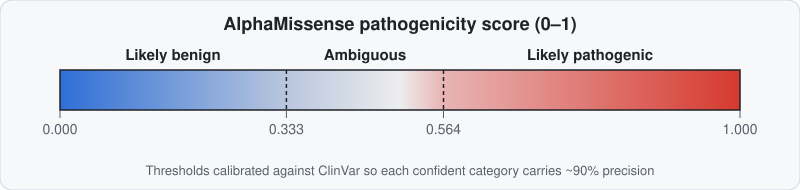

# What is AlphaMissense?

AlphaMissense is a separate DeepMind model — not AlphaFold2 or AlphaFold3 itself, but built on top of AlphaFold2's architecture — that predicts how likely a **missense variant** (a single amino-acid substitution) is to be pathogenic, across essentially the entire human proteome.

## What it predicts

!!! info "Beginner"
    For a given position in a human protein, AlphaMissense assigns each of the 19 possible amino-acid substitutions a **pathogenicity score from 0 to 1**, which is then bucketed into three categories, calibrated against ClinVar so that the two confident calls each carry ~90% precision:

    | Score | Category |
    |---|---|
    | 0.000 – 0.333 | Likely benign |
    | 0.334 – 0.564 | Ambiguous |
    | 0.565 – 1.000 | Likely pathogenic |

    

    Scale: AlphaMissense scored **89% of all ~71 million possible human missense variants** — compared to roughly 0.1% that had previously been manually classified by human curators. Of the scored variants, 57% were predicted likely benign and 32% likely pathogenic.

!!! tip "Advanced: how it's built"
    AlphaMissense reuses AlphaFold2's architecture (a fork of the AF2 codebase) and its inputs: a multiple sequence alignment (via jackhmmer against UniRef90, MGnify, and a small BFD subset) plus AlphaFold-predicted **structural context** — letting the model reason about a variant's local 3D environment (buried core vs. surface, secondary structure), not just raw sequence conservation.

    Crucially, it is fine-tuned using **weak labels from human and primate population-frequency data** — variants observed in humans or closely related primates act as a proxy for "tolerated," while variants never observed act as a proxy for "possibly deleterious." It is **deliberately not trained directly on ClinVar or other curated pathogenicity databases** — ClinVar is used only afterward, to calibrate the score thresholds and benchmark performance, avoiding circularity.

    Model weights are not public; only precomputed predictions (CC BY 4.0) and reference code (Apache 2.0) are released, distributed via a Google Cloud Storage bucket.

## Where to find AlphaMissense scores

!!! tip "Advanced: access points"
    - **[AlphaFold Protein Structure Database](https://alphafold.ebi.ac.uk)**: for human proteins, toggle the 3D viewer between coloring by pLDDT and coloring by average AlphaMissense score per residue, with an interactive per-position heatmap of all 19 substitutions. Data is downloadable.

        !!! warning "Check which sequence you're actually looking at"
            This question [comes up regularly](https://github.com/google-deepmind/alphafold/issues/957): historically, AlphaFold DB predictions were generated exclusively from **UniProt canonical (reference) sequences**, not isoforms — if your protein of interest is expressed predominantly as a non-canonical isoform, the canonical prediction (and any AlphaMissense scores mapped onto it) may not correspond position-for-position to the isoform you actually care about. The 2025 database redesign began adding dedicated **isoform-specific predictions** (starting with human), so check which sequence variant a given entry was actually built from before assuming residue numbering lines up with your isoform of interest.
    - **UniProt**: scores shown directly in the ProtVista feature viewer, queryable by accession/entry/gene name.
    - **Ensembl VEP** (Variant Effect Predictor): enable AlphaMissense as an annotation source (web, REST API, or CLI) — output includes both the numeric score and the categorical call.
    - **ProtVar** (EBI): integrates AlphaMissense with UniProt functional annotations at residue level.
    - **DECIPHER**: score and category shown on variant pages, aimed at rare-disease investigation.
    - **AlphaMissenseR** (Bioconductor): programmatic R access, including helpers that cross-reference AlphaFold structures via UniProt ID.
    - **[ChopChopMF](../chopchopmf/workflows.md#2-is-this-variant-likely-pathogenic-alphamissense-mapping)**: fetch a human structure with scores directly inside ChimeraX by UniProt ID, or map scores onto a non-human ortholog via alignment.

## How scores are visualized on structures

!!! info "Beginner"
    The standard convention colors residues on a gradient from **blue (benign, score → 0) through white (ambiguous, ≈0.5) to red (pathogenic, score → 1)**. Practically, this is done by writing the average AlphaMissense score into the B-factor column of the structure file (replacing pLDDT, which normally occupies that column) so any standard viewer — PyMOL, ChimeraX — can color by B-factor.

    !!! danger "A high score means constraint, not a diagnosis"
        A high pathogenicity score at a position indicates **evolutionary constraint / functional importance** — it does not tell you *what* the functional consequence is (loss of stability? loss of an interaction surface? altered catalysis?), and it is not a disease diagnosis.

## What it's useful for — and what it isn't

!!! tip "Advanced"
    - **Useful for**: proteome-scale triage of variants of uncertain significance (VUS), prioritizing which of millions of possible missense variants are worth a closer look, and as *supporting* computational evidence under ACMG/AMP variant-classification guidelines (e.g. criteria like PP3/BP4) — one input among several, never sufficient alone.
    - **Not useful for**: standalone clinical diagnosis. DeepMind's own documentation states the model "has not been validated for, and is not approved for, any clinical use." It is not disease-specific (a damaging score doesn't indicate *which* disease or phenotype), doesn't model dominant vs. recessive mechanisms or dosage sensitivity, and — being a large deep-learning model — offers no mechanistic explanation for *why* a variant is predicted damaging.

??? example "Expert: known limitations and benchmark caveats"
    - **Tends to over-predict pathogenicity.** Independent benchmarking against deep mutational scanning (functional assay) data found AlphaMissense — like REVEL and other predictors — tends to over-call pathogenicity for variants that show minimal functional impact experimentally.
    - **Modest edge over prior methods.** Across ~17,700 variants spanning 5 genes benchmarked against 38 other predictors, AlphaMissense ranked top-5 for every gene and was the single best for 2 of 5 (PTEN, BRCA1) — but the margin over the next-best method (REVEL) was modest, and PrimateAI-3D was competitive or better for some genes.
    - **Rare-disease discordance.** At least one independent evaluation across 45 rare diseases reported comparatively low precision (~33%) and recall (~58%) against expert-curated pathogenic variant sets — a meaningful gap from what "90% precision on ClinVar" might suggest for messier real-world cohorts.
    - **Training data scarcity is the likely bottleneck.** Independent benchmarking work attributes remaining error largely to limited high-quality functional/population training data, and calls for more MAVE (multiplexed assay of variant effect) studies and more diverse population cohorts.

## Using AlphaMissense on a non-human protein

!!! tip "Advanced"
    AlphaMissense scores only exist for human proteins natively. To reason about a variant in a mouse, zebrafish, or other model-organism ortholog, align it against its **human ortholog** and transfer scores only for **conserved** positions — unmatched positions get no score. See the [ChopChopMF Missense Alignment workflow](../chopchopmf/workflows.md#2-is-this-variant-likely-pathogenic-alphamissense-mapping) for the practical steps, and note the same page's caution: trust **extended, contiguous conserved stretches** far more than an isolated single-residue match when extrapolating a score across species.

Continue to [Running ColabFold (local/HPC) →](../running-colabfold/hpc-and-local.md)
