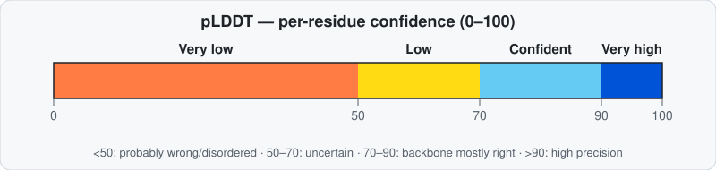
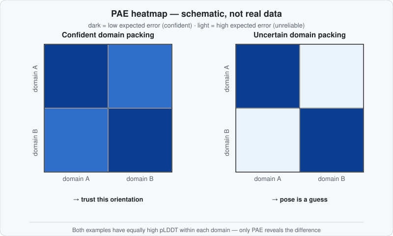
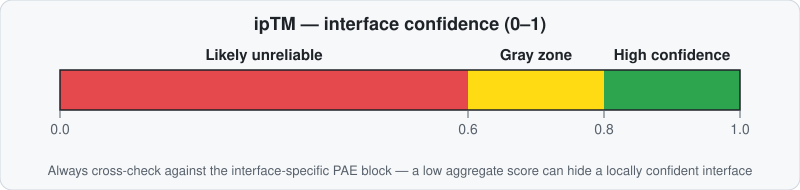
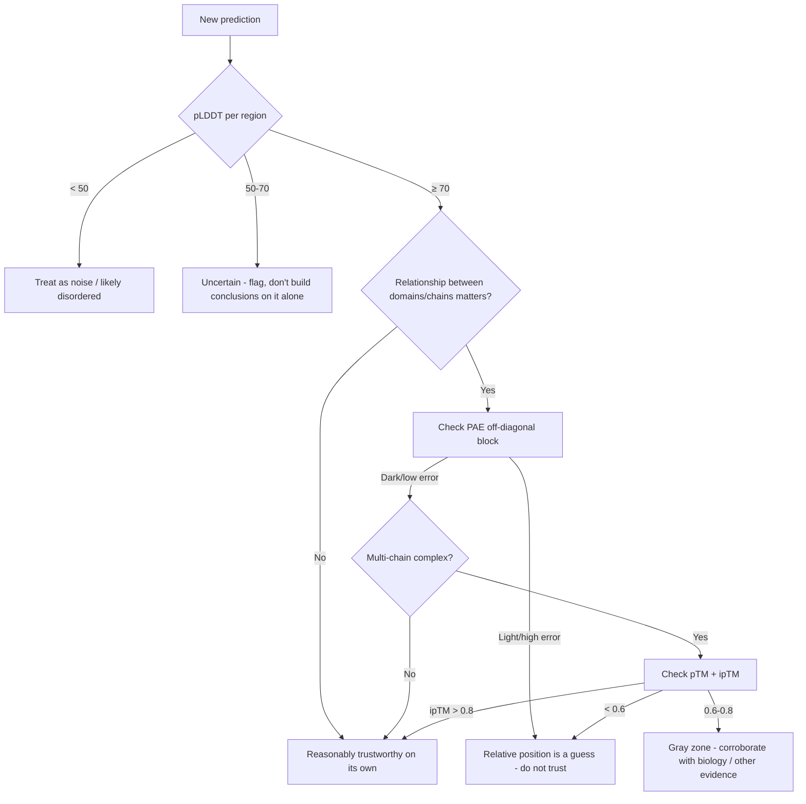

# Reading Confidence Metrics: pLDDT, PAE, pTM & ipTM

AlphaFold and ColabFold don't just give you a structure — they give you an estimate of how much to trust each part of it. Learning to read that estimate is the single most important skill for using these tools responsibly. The short version: **pLDDT tells you about one residue; PAE tells you about the relationship between two residues; pTM/ipTM boil an entire structure or interface down to one number.** None of them substitutes for the others.

!!! tip "See it on a real structure first"
    Before the theory, [Try It: A Real Example Protein](../example-protein.md) puts an interactive 3D viewer with live pLDDT coloring in front of you — worth a look before or after reading this page.

## Try it: what does *your* score mean?

  
Drag the sliders to your own numbers and get a plain-language read — the same thresholds explained below, applied live.

  

    <label for="af-calc-plddt">pLDDT for the region you care about: <strong id="af-calc-plddt-val">75</strong></label>
    <input type="range" id="af-calc-plddt" min="0" max="100" value="75" step="1">
  

  

    <label><input type="checkbox" id="af-calc-multimer"> This is a multimer/complex — I also have an ipTM score</label>
  

  

    <label for="af-calc-iptm">ipTM: <strong id="af-calc-iptm-val">0.70</strong></label>
    <input type="range" id="af-calc-iptm" min="0" max="100" value="70" step="1">
  

  

## pLDDT — per-residue local confidence

!!! info "Beginner"
    pLDDT (**p**redicted **L**ocal **D**istance **D**ifference **T**est) is a **0–100 score for each residue**, estimating how well that residue's local environment matches reality. Higher is better. It's usually shown as the coloring on the 3D cartoon:

    | Range | Label | What it means |
    |---|---|---|
    | > 90 | Very high | Backbone *and* side chains placed with high precision |
    | 70–90 | Confident | Backbone generally right; side chains may be off |
    | 50–70 | Low | Uncertain — interpret with caution |
    | < 50 | Very low | Probably wrong; often disordered |

    

    Low-pLDDT stretches are frequently **intrinsically disordered regions (IDRs)** — parts of the protein with no single fixed structure — or simply regions where AlphaFold didn't have enough evolutionary information to work with (e.g. flexible linkers between domains).

??? tip "Advanced"
    pLDDT is computed from four binary distance-agreement tests at increasingly strict thresholds (4 Å, 2 Å, 1 Å, 0.5 Å) between predicted and (during training) true inter-atomic distances; the reported score is essentially the average pass rate across those thresholds. In **AlphaFold3**, pLDDT becomes a **per-atom** score computed for every molecule type (proteins, nucleic acids, ligands) rather than only per-residue for proteins.

    Practical use: read the **[ChopChopMF pLDDT coloring / AlphaSync](../chopchopmf/workflows.md#1-first-look-at-a-fresh-alphafold-model-plddt-coloring)** workflow to get this per-residue table directly in ChimeraX rather than eyeballing colors.

??? example "Expert: pLDDT is not a clean disorder detector"
    Several failure modes are easy to miss:

    - **A low-pLDDT helix usually means a *transient* helix, not a wrong one.** Because AlphaFold outputs a single fixed set of coordinates, it cannot directly represent a conformational ensemble. When a local sequence has some helix-forming propensity (e.g. an amphipathic pattern, or a short Molecular Recognition Feature/MoRF that folds only upon binding a partner) but sits within an otherwise intrinsically disordered region (IDR), the model will often still draw a helix — but flags it with pLDDT in the 50–70 range or below. Read that combination (helical geometry + low pLDDT) as "this helix probably forms only transiently or conditionally," not as a modeling error to discard. One study comparing AF2 predictions to NMR/SAXS conformational ensembles found pLDDT and structural heterogeneity across the ensemble "agreed closely with the observed secondary structure from the ensembles" — i.e. a lower-pLDDT helix among two candidate helices is consistent with it existing only transiently, while conversely a *coiled* region with unexpectedly *high* pLDDT can itself be a signal of a disorder-to-order transition or a conserved role in some biophysical interaction ([PMC9104326](https://pmc.ncbi.nlm.nih.gov/articles/PMC9104326/)).
    - **Conditionally-folded IDRs can score deceptively high, not just low.** Some IDRs only adopt a defined structure when bound to a partner or after a post-translational modification. AlphaFold, given only the naked sequence, can still predict these with *high* pLDDT — apparently because the co-evolutionary signal implicitly encodes the bound/modified conformational state. A high-confidence prediction for a region known (or suspected) to be an IDR should **not** automatically be read as "stably folded in isolation." Researchers have used exactly this signature to systematically hunt for conditionally-folding IDRs at proteome scale ([PMC10622901](https://pmc.ncbi.nlm.nih.gov/articles/PMC10622901/)).
    - **~10% of low-pLDDT stretches aren't about disorder at all** — other sources of local uncertainty (shallow MSA, genuinely hard local geometry) can also depress the score. Don't treat pLDDT < 50 as synonymous with "disordered" without corroborating a dedicated disorder predictor or experimental evidence.
    - **A minor, preliminary observation worth knowing about**: one community-reported analysis found that the geometric angle between a residue's backbone-propagation direction and its hydrogen-bond vector in secondary structure elements — a near-constant ~23° for alpha-helices and ~13° for antiparallel beta-sheets in real structures — deviates more in low-pLDDT regions than high-pLDDT ones, with low-confidence helices showing roughly 79% more severe geometric violations ([GitHub discussion](https://github.com/google-deepmind/alphafold/issues/1122)). The reported effect size is tiny (~0.7% of variance explained), so this is at most a supplementary sanity signal, not a validated tool — but it's a reminder that pLDDT correlates with more than just "is this residue in the right place": subtle backbone geometry quality tracks with it too.

    !!! danger "AlphaFold3-specific: spurious/hallucinated helices"
        AlphaFold2 is non-generative and typically renders disordered regions as loose, unstructured "spaghetti" ribbons — visually easy to recognize as low-confidence. **AlphaFold3 is a generative (diffusion-based) model**, and per EBI's training material it "sometimes predicts spurious structural order (hallucinations) in disordered regions" — including forming **alpha-helical structures instead of the expected ribbon-like appearance**. These hallucinated helices are still "usually marked as very low confidence, with pLDDT scores well below 50," but they lack AF2's telltale unstructured look, so **in AF3 output, low pLDDT is the primary — sometimes the only — signal that a confident-looking helix isn't real.** EBI notes such hallucinations are rare overall, but the practical implication is: in AF3 models, never let a clean-looking helix override a low pLDDT score. ([EBI: What AlphaFold 3 struggles with](https://www.ebi.ac.uk/training/online/courses/alphafold/alphafold-3-and-alphafold-server/introducing-alphafold-3/what-alphafold-3-struggles-with/))

## PAE — Predicted Aligned Error

!!! info "Beginner"
    In plain terms: **PAE is how sure AlphaFold is that two residues are positioned correctly relative to each other in space** — not "is this residue folded right" (that's pLDDT), but "if residue *y* is exactly where I put it, how far off would residue *x* be?" It's measured for **every pair** of residues, shown as a 2D heatmap (both axes = residue number), usually with **dark = low error/confident, light = high error/unreliable**.

    The diagonal is always dark (a residue compared to itself) — ignore it. What matters are the **off-diagonal blocks**: a dark block between residue ranges of two domains (or two chains in a complex) means AlphaFold is confident about how they're positioned *relative to each other*. A light block means that relative placement is essentially a guess.

    

!!! question "Why do I need PAE if I already have pLDDT?"
    Because they answer genuinely different questions, and pLDDT structurally *cannot* answer the one PAE answers. pLDDT is purely local — it's telling you "is residue N's own immediate environment modeled correctly," one residue at a time. It has no mechanism for expressing "domain A and domain B are each folded perfectly, but I have no idea how they're rotated relative to each other" — and that exact situation is common. A structure can show **uniformly high pLDDT in two well-folded domains while PAE reveals their relative orientation is essentially random.** This is the single most common way people over-trust a multi-domain or multimeric prediction: they see a confident-blue cartoon, and stop looking. Any claim about how two domains or two chains sit *relative to each other* needs the corresponding **off-diagonal PAE block** — pLDDT alone cannot tell you.

!!! tip "Advanced: chance or determination? — why PAE is what makes multimer predictions useful"
    Reframing the question this way is the key intuition for complexes: for a residue pair spanning two different chains, low PAE means "AlphaFold has real, determined evidence for exactly this relative placement," while high PAE means "AlphaFold has no meaningful basis for this arrangement — treat the two chains' relative pose as essentially undetermined."

    This distinction matters enormously in practice because of a specific, well-documented behavior: **when you give AlphaFold/ColabFold two chains to predict as a complex, it will place them near each other in the output regardless of whether they actually interact** — there is no "these don't bind" output option; the model must produce *some* single relative pose. So visually seeing two chains in contact in the 3D cartoon proves nothing on its own — that contact could be a genuine, confidently-determined interface, or it could be an artifact of the model having to put the second chain *somewhere*. **The inter-chain PAE block is what tells the two cases apart**: low PAE across the interface residues means the proximity you're looking at is a determined prediction; high PAE means it's closer to arbitrary, and you should not read biological meaning into that contact without independent evidence.

    For complexes, the **inter-chain blocks** of the PAE matrix are therefore your primary evidence for whether a predicted interface is real — this is exactly what the ipTM score (next section) tries to summarize into one number. ChopChopMF's [PAE Contacts workflow](../chopchopmf/workflows.md#5-reading-confidence-in-a-multimercomplex-pae-contacts) turns this into visible pseudobonds in ChimeraX; for a full all-vs-all heatmap across a large complex, the standalone [PAE Viewer](https://pae-viewer.uni-goettingen.de/) is a useful companion.

??? example "Expert: why Ångström, precisely — and related metrics"
    PAE is literally a 3D distance-error estimate, which is why it's reported in Ångströms rather than as a unitless score like pLDDT or pTM. Mechanically: take the predicted backbone frame (N, Cα, C atoms) of residue *y*, superimpose/rotate it exactly onto residue *y*'s position in the (hypothetical) true structure, and ask — with that one point pinned down as a reference frame — how far, in Å, does residue *x*'s predicted Cα then land from where it truly is? This is discretized into 64 bins and repeated for every (x, y) pair to build the full matrix. AlphaFold3 generalizes the same idea to backbone frames for polymers and per-atom neighbor frames for ligands/PTMs, and adds a related metric, **PDE (Predicted Distance Error)** — pairwise distance accuracy independent of frame alignment.

    Because PAE depends on *which* residue you anchor on, **it is not symmetric in general**: the error at *x* when aligning on *y* isn't necessarily the same as the error at *y* when aligning on *x* — anchoring on a residue in a large, rigid domain tends to produce lower error elsewhere in that same domain than anchoring on a residue in a small, wobbly appendage, since a small/flexible anchor is itself a less stable reference frame.

    You'll sometimes see papers report **"iPAE"** (interface PAE) as a single summary number rather than the full matrix — this isn't an official AlphaFold output field, and [users have pointed out the AlphaFold-Multimer paper doesn't spell out how to compute it](https://github.com/google-deepmind/alphafold/issues/928). In practice it's derived post-hoc from the raw PAE matrix in the output pickle/JSON: extract the inter-chain PAE values (typically restricted to residue pairs within some distance cutoff, e.g. ~3.5–8 Å in published pipelines) and summarize them — commonly as a mean or as the lowest peak of the inter-chain PAE distribution. Because there's no single standardized definition, treat a reported "iPAE" number cautiously and check the specific paper's/tool's methods for exactly how it was computed before comparing it across studies.

    If you specifically want the domain-packing/interface consistency issue solved for you with an established metric instead of a home-grown "iPAE," see **actifpTM** — a refined AlphaFold2 confidence metric published specifically to handle flexible/multi-domain regions better than raw ipTM.

## pTM and ipTM — one number for a whole structure or interface

!!! info "Beginner"
    - **pTM** (predicted TM-score) summarizes the accuracy of the *entire* predicted fold in a single number, roughly 0–1. As a rule of thumb: **> 0.5** means the overall fold might resemble the truth; **< 0.5** means it likely doesn't.
    - **ipTM** (interface predicted TM-score) is the same idea, but restricted to the **interface between chains** in a complex — the single most useful number for "is this predicted protein-protein interaction believable?"

    | ipTM | Interpretation |
    |---|---|
    | > 0.8 | High-quality, confident interface |
    | 0.6 – 0.8 | Gray zone — could go either way, look closer |
    | < 0.6 | Likely unreliable |

    

!!! tip "Advanced: don't stop at the single number"
    - pTM can be **dominated by a large subunit** in complexes with very unequal chain sizes, masking a poorly predicted small partner — always sanity check the small chain's own pLDDT/PAE too.
    - **Legitimate disorder can drag ipTM down** even when the actual interface of interest is well predicted, since disordered regions elsewhere in the complex still count against the aggregate score. If ipTM looks mediocre, check whether the *specific* interface you care about has a dark PAE block before writing the whole prediction off.
    - AlphaFold3 reports a composite `ranking_score = 0.8 × ipTM + 0.2 × pTM + 0.5 × fraction_disordered − 100 × has_clash` to rank multiple output models — `has_clash` is a hard penalty for physically implausible structures (heavy atomic clashes).

!!! example "Real-world example: why rank-0 alone isn't enough"
    A user screening ligand-receptor pairs with AlphaFold-Multimer 2.3.1 [reported ipTM scores ranging from 0.30 to 0.88 across the five models for the *same* input pair](https://github.com/google-deepmind/alphafold/issues/1082) — and asked whether to trust only the top model or average across all five. There's no universal answer, but the guidance above gives you a way to reason about it: don't just take the single highest ipTM at face value. Look at *why* the models disagree — is it a genuinely ambiguous/flexible interface (in which case the spread itself is informative — a real signal of uncertainty, not noise to average away), or is one model an outlier while four cluster together (in which case the cluster is probably more trustworthy than any single extreme)? Either way, large variance across the five models is itself a finding worth reporting, not a nuisance to collapse into one number.

??? example "Expert: known failure regimes"
    - For structures/complexes under roughly **20 tokens**, pTM becomes statistically unreliable (pinned near ~0.05) regardless of actual quality — trust PAE and pLDDT instead in that regime.
    - Some large-scale interaction-screening pipelines (using speed-optimized, minimal-recycling settings) have used ipTM cutoffs as low as **~0.3** purely as a first-pass filter over huge candidate sets — but hits at that threshold still require independent, targeted verification and should never be treated as confident findings on their own.
    - Confidence scores in AlphaFold3/Server are **context-dependent, not a fixed property of the sequence**: adding or removing ions, cofactors, ligands, or other chains from the same job changes the reported pLDDT/PAE/ipTM for a given protein. Always evaluate a prediction under the biologically relevant input composition, not a stripped-down convenience version of it.

## A practical trust-checklist

!!! tip "Advanced workflow"
    1. **Start with pLDDT** to triage which regions are worth looking at closely (≥70) vs. treating as noise/disorder (<50).
    2. **Check the PAE off-diagonal blocks** for every domain-domain or chain-chain relationship your conclusion depends on — never infer relative positioning from pLDDT alone.
    3. **For complexes**, read pTM + ipTM together, but cross-reference the specific interface's PAE block before trusting or dismissing based on the aggregate score alone.
    4. **Sanity-check low-confidence regions against biology**: is disorder expected there (terminus, known flexible linker)? If disorder would be biologically surprising, treat the low score as a possible prediction failure rather than true flexibility.
    5. **Don't rely on rank-0 alone** — AlphaFold/ColabFold typically output 5 ranked models; check whether your conclusion holds across the top models, not just the single best-ranked one.
    6. **Recommended reading order for a fresh result**: MSA/sequence-coverage plot → pLDDT plot → PAE plot → 3D structure. Forming an expectation of reliability *before* looking at the cartoon avoids being visually seduced by a nice-looking but poorly-supported fold. See [Presenting & Sharing Results](../running-colabfold/best-practices.md) for how to report all of this in a paper.

One more input factor is worth knowing before you trust — or dismiss — a score: see [What Actually Influences a Prediction?](what-influences-a-prediction.md) for why the sequence/MSA matters far more than you might expect, and why a single point mutation rarely moves these numbers the way you'd hope.

Continue to [What Actually Influences a Prediction? →](what-influences-a-prediction.md)
