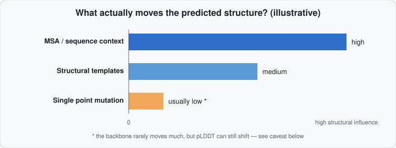

# What Actually Influences a Prediction?

Now that you can read pLDDT and PAE (see [Confidence Metrics](confidence-metrics.md)), a natural next question is: what, in the *input*, actually moves those numbers and the resulting structure? The honest answer surprises a lot of people coming from a classic "sequence → structure" mental model.

## The ranking

!!! info "Beginner"
    In roughly descending order of how much they change the predicted structure:

    1. **The multiple sequence alignment (MSA) / evolutionary context** — by far the dominant signal. AlphaFold reasons primarily from coevolutionary patterns across homologs, not from first-principles chemistry (see [How AlphaFold Works](../fundamentals/how-alphafold-works.md)).
    2. **Structural templates**, when available — a secondary but real influence, especially for regions with a close homolog already solved.
    3. **The exact identity of one residue** (a point mutation) — usually a surprisingly *minor* influence on the predicted backbone, even when that mutation has a large real biological effect.

## Point mutations: structure barely moves, confidence sometimes does

!!! tip "Advanced"
    This is well documented, not a guess: AlphaFold2 is largely **insensitive to single point mutations**. EBI's own training material states it plainly: *"AlphaFold is not sensitive to point mutations that change a single residue... This is because of a lack of data on the effect of variations, combined with AlphaFold2's focus on patterns as opposed to calculating physical forces."*

    Independent case studies make this concrete — comparing wild-type vs. a known damaging mutant, AlphaFold2 predicted nearly identical backbones and, in some cases, **higher** confidence for the *damaging* mutant:

    | Protein / mutation | Structural change | pLDDT (WT → mutant) | Known real-world effect |
    |---|---|---|---|
    | UBA1 L198A | 0.1 Å Cα deviation | 84 → 84 | Causes intrinsic disorder |
    | MyUb R1117A | — | 89 → **90** | Abolishes a known protein interaction |
    | BRCT A1708E | 0.6 Å Cα deviation | 95 → 94 | Destabilizes the domain |

    (Source: ["Can AlphaFold2 predict the impact of missense mutations on structure?"](https://pmc.ncbi.nlm.nih.gov/articles/PMC11218004/), PMC11218004.)

    !!! danger "Don't treat a pLDDT shift after an in-silico mutation as confirmed evidence"
        A pLDDT change after mutating a residue *can* reflect something real — but the literature above shows it frequently doesn't track the actual structural/stability consequence at all, and can even move in the *wrong direction* (higher confidence for a more damaging mutant). Multiple independent studies report weak-to-no correlation between pLDDT and mutation-induced misfolding or stability loss. **Use a pLDDT shift as a hypothesis to investigate, never as proof of a dynamics change** — pair it with an actual stability/folding assay, a dedicated disorder predictor, or (for pathogenicity specifically) [AlphaMissense](alphamissense.md), which was purpose-built and separately trained for exactly this question, rather than repurposing raw AlphaFold2 for it.

## Why the model behaves this way

??? example "Expert: no force field, no PTMs, no dynamics — by design"
    AlphaFold2 "predicts structures based on those available in the PDB [and the evolutionary patterns across the MSA], rather than by fundamental driving forces of protein folding" — it has no physical force field and was never trained on labeled examples of *which specific point mutations* destabilize a fold, only on solved structures and their natural sequence variation across species. A single substitution is a vanishingly small perturbation to the pattern the MSA encodes across dozens or hundreds of homologs, so the network has little reason to move the backbone in response to it — even when that substitution would be catastrophic in the lab.

    **Post-translational modifications (PTMs) are a related but distinct story:**

    - **AlphaFold2 has no representation for PTMs at all.** The input is a plain amino-acid sequence; phosphorylation, glycosylation, acetylation etc. simply don't exist in that input space. Some users approximate a phosphorylation with a phospho-mimetic substitution (e.g. Ser→Asp/Glu), but this is a rough proxy, not a modeled PTM.
    - **AlphaFold3 supports certain PTMs as explicit, first-class input**: phosphorylation of serine/threonine/tyrosine/histidine, and glycan chains, each represented as their own atoms/tokens with a dedicated per-atom confidence frame (built from the atom's nearest neighbors in a reference conformer, rather than a protein backbone frame). This means AF3 can, unlike AF2, actually shift a prediction in response to a specified PTM — see [AF2 vs. ColabFold vs. AF3](../fundamentals/af2-vs-colabfold-vs-af3.md).

    **The deeper reason this all connects to dynamics:** proteins are not the single rigid shape AlphaFold outputs. EBI's own limitations page is direct about this: *"Proteins undergo structural changes when they perform their functions... AlphaFold2 does not capture such conformational changes, as it was designed to predict static structures."* A real protein is better thought of as an ensemble of conformations with different populations — and a mutation can genuinely shift that population (e.g. making a transient helix more or less likely to be occupied at any given moment) without necessarily "breaking" the dominant fold AlphaFold reports. This is exactly the phenomenon discussed in [Confidence Metrics → pLDDT is not a clean disorder detector](confidence-metrics.md#plddt-per-residue-local-confidence): a helix with borderline pLDDT is plausibly read as *transient*, not wrong — but as the table above shows, don't expect pLDDT to move in lockstep with every mutation that could shift that population. Researchers who specifically want to probe alternative conformations from AlphaFold have developed workarounds — subsampling or clustering the input MSA (e.g. AF-Cluster-style approaches) to coax the network toward different plausible states of the same protein — but this is a deliberate trick, not something a default single run gives you.

## Takeaways

!!! tip "Advanced summary"
    - Changing the **MSA** (different depth, different database, added/removed homologs) will move a prediction far more than changing **one residue** in the query sequence.
    - Don't run "mutant vs. wild-type" AlphaFold2 predictions expecting the backbone or pLDDT to reliably reveal whether a mutation is damaging — that's not what the pLDDT number was trained to measure, and case studies show it often fails at this specific task.
    - If your actual question is "*is this variant pathogenic?*", reach for [AlphaMissense](alphamissense.md) — a model specifically trained for that question — rather than reading tea leaves from a raw structure prediction.
    - If you need a PTM to actually influence the model, you need **AlphaFold3**, not AlphaFold2/ColabFold.

Continue to [AlphaMissense →](alphamissense.md)
