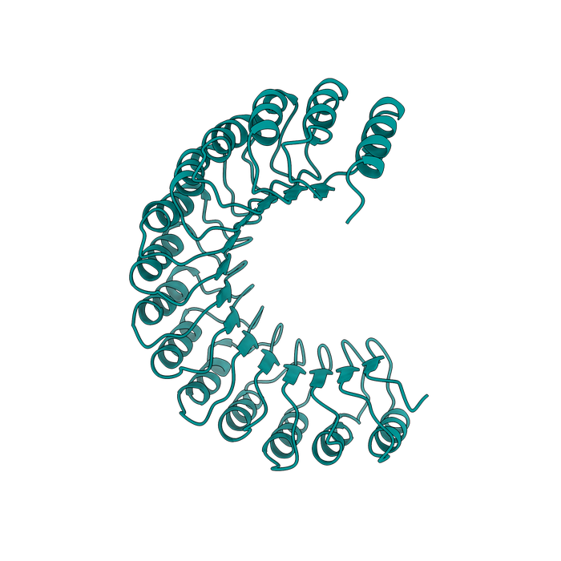

# Visualization Tools — and Why This Guide Uses ChimeraX

A predicted structure is a set of atomic coordinates plus confidence metadata — you need dedicated software to actually look at it, color it by pLDDT/AlphaMissense, measure distances, or produce a figure. This page gives a quick landscape of the main options, then explains (openly, as an opinion) why the rest of this guide standardizes on one of them.

## The main options

!!! info "Beginner"
    | Tool | License | Known for |
    |---|---|---|
    | **[ChimeraX](https://www.cgl.ucsf.edu/chimerax/)** | Free for academic/non-profit use; commercial use needs a paid UCSF license | Broad, modern feature set — cryo-EM density maps/fitting, AlphaFold/PAE integration, a large plugin ecosystem (Toolshed) |
    | **[PyMOL](https://pymol.org/)** | Free open-source edition; "Incentive PyMOL" (Schrödinger) is a paid, fully-supported version | The long-standing gold standard for ray-traced, publication-quality figures; deep Python scripting |
    | **[VMD](https://www.ks.uiuc.edu/Research/vmd/)** | Free for non-commercial/academic research | Strong for molecular dynamics trajectory visualization and analysis |
    | **[Mol\*](https://molstar.org/)** | Fully open-source, free | Runs in the browser — no install; this is what powers the RCSB PDB and AlphaFold DB's own online viewers |

    None of these is objectively "best" — they overlap heavily and each has a real community behind it. What matters is picking one and learning it well enough to trust what you're seeing.

## Our take — and why this guide picks ChimeraX

!!! tip "This is an opinion, not a fact — taste is genuinely subjective here"
    This guide works exclusively with **ChimeraX**, for three reasons, roughly in order of how objective they are:

    1. **It's free for the academic/non-profit use this guide is written for.** (If your use is commercial, check UCSF's licensing terms before assuming that holds for you.)
    2. **It has a large, active plugin ecosystem** via the built-in Toolshed — including [ChopChopMF](chopchopmf/index.md), which this guide leans on heavily for AlphaFold-specific analysis (pLDDT/PAE/AlphaMissense coloring, Foldseek, PDBePISA) without writing a single command.
    3. **In our (admittedly biased) opinion, it makes the best-looking figures** of the options above, once you learn its rendering and lighting presets — but this is genuinely a matter of taste, and plenty of excellent structural biologists would tell you PyMOL is the real gold standard for publication-quality ray-traced images, with a scripting ecosystem that's been refined for over two decades. If you already have a PyMOL workflow you're happy with, there's no strong reason to switch on our say-so.

    The one *practical* (non-opinion) constraint: since [ChopChopMF](chopchopmf/index.md) — the tool this guide's hands-on workflows are built around — is a ChimeraX plugin, following those specific workflows does require ChimeraX. The underlying concepts (reading pLDDT/PAE, cropping a domain before a homology search, mapping interface residues) transfer to any of the tools above; only the exact button clicks are ChimeraX/ChopChopMF-specific.

## Finding plugins: the ChimeraX Toolshed

!!! info "Beginner"
    The [ChimeraX Toolshed](https://cxtoolshed.rbvi.ucsf.edu/) is ChimeraX's built-in plugin repository — browsable by category on the web, or directly inside the app via **Tools → More Tools**. Anyone can publish a bundle there; each listing shows a thumbnail, download counts, and ratings. It's the same mechanism the [ChopChopMF installation steps](chopchopmf/index.md#installation) use.

## Two plugins this guide relies on

  

    
    <h3>ChopChopMF</h3>
    
The point-and-click AlphaFold/ColabFold <strong>analysis</strong> toolkit this guide's hands-on workflows are built around: pLDDT/PAE/AlphaMissense coloring, cropping, Foldseek, PDBePISA — all covered in <a href="chopchopmf/">ChopChopMF</a>.

    
<a href="https://lukasinscience.github.io/ChopChopMF/">Docs</a> · <a href="https://github.com/LUKASinScience/ChopChopMF">GitHub</a> · <a href="https://cxtoolshed.rbvi.ucsf.edu/apps/chimeraxchopchopmf">Toolshed</a>

  

  

    
    <h3>FigureStyle</h3>
    
The <strong>last step after analysis</strong>: define lighting, per-secondary-structure cartoon style, coloring (including AlphaFold pLDDT), and export settings once as a named template — then apply it to any structure with one click. Built for easy, <em>repeatable</em> figures: the same template gives every structure in a paper identical, reproducible styling instead of retyping commands each time.

    
<a href="https://lukasinscience.github.io/ChimeraX-FigureStyle/">Docs</a> · <a href="https://github.com/LUKASinScience/ChimeraX-FigureStyle">GitHub</a>

  

!!! tip "Advanced: what FigureStyle actually saves you"
    Six coloring modes (none, single color, by-chain rainbow, by B-factor, by heteroatom, AlphaFold pLDDT), configurable image export (PNG/TIFF/JPEG, custom resolution and supersampling — PNG/TIFF keep transparency, JPEG doesn't), and templates that export as JSON or standalone `.cxc` ChimeraX scripts for sharing with a lab or co-authors. Once a template exists, applying it from the command line is one line: `figurestyle apply "Template Name"` — useful for batch-rendering many structures with identical, reproducible styling (exactly the kind of consistency the [best-practices](running-colabfold/best-practices.md) page recommends for a paper's figures).

Continue to [ChopChopMF →](chopchopmf/index.md)
